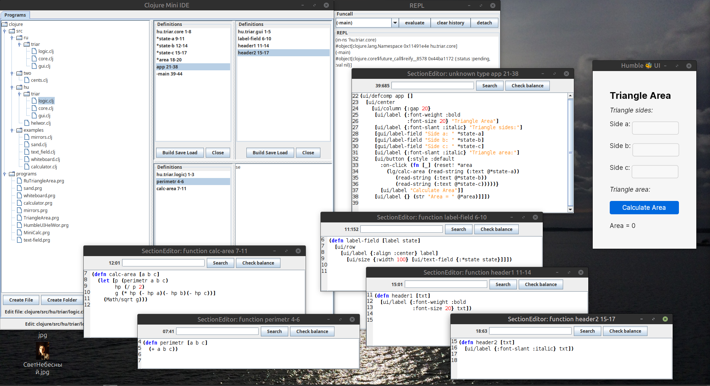

# ClojureMiniIDE
A minimalistic integrated development environment for the Clojure programming language.



## Special Features

1. **Program.** 
In Clojure, there's no concept of a "program"; there's only the concept of a "namespace". 
These aren't quite the same thing. A given task typically requires multiple namespaces. 
ClojureMiniIDE defines a *program* as an ordered sequence of namespaces. 
The order is determined by the order in which namespaces must be loaded, 
as this is essential for program operation. 
A special button is available for automatically loading a program.

2. **Separate windows for functions and other program elements.** 
This allows you to simultaneously edit multiple functions on the screen, from different namespaces, 
and only those needed at the moment. The automatic loading button simultaneously 
composes ("builds") various namespaces from all open and possibly modified elements, 
saves them, and loads them in the desired order.

## Usage

Put into a some directory:

- clojure folder,
- lib folder,
- Funcall_History.txt file,
- ConstructPrefixces.txt file,
- run.sh file.

```shell
$ cd <some directory>
$ ./run.sh       # Linux, MacOS
$ run.bat        # Windows
```

## Construct prefixces

To create separate windows for functions and other program elements, the namespace file is divided into sections. 
A separate section is created for a program element whose name begins with a prefix from the ConstructPrefixes.txt file. 
Initially, it contains the prefixes "ns" and "def." 
If your programming environment contains other constructs, 
add the corresponding prefixes to separate lines in this file.

## Video Lessons

[Lesson 1. Creating of a program file structure](https://www.youtube.com/watch?v=vPH-KzR2LiI)

[Lesson 2. Writing  a program](https://www.youtube.com/watch?v=4044rY_TG5A)

[Lesson 3. Debugging  a program](https://www.youtube.com/watch?v=nnIGX-z1Qck)

## License

Copyright © 2025-2026 Ruslan Sorokin

Distributed under the Eclipse Public License either version 1.0 or (at
your option) any later version.
